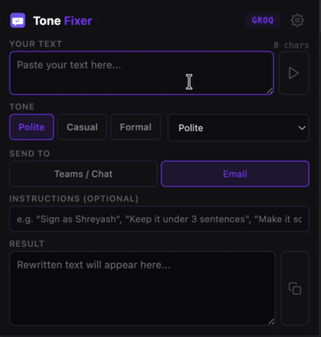
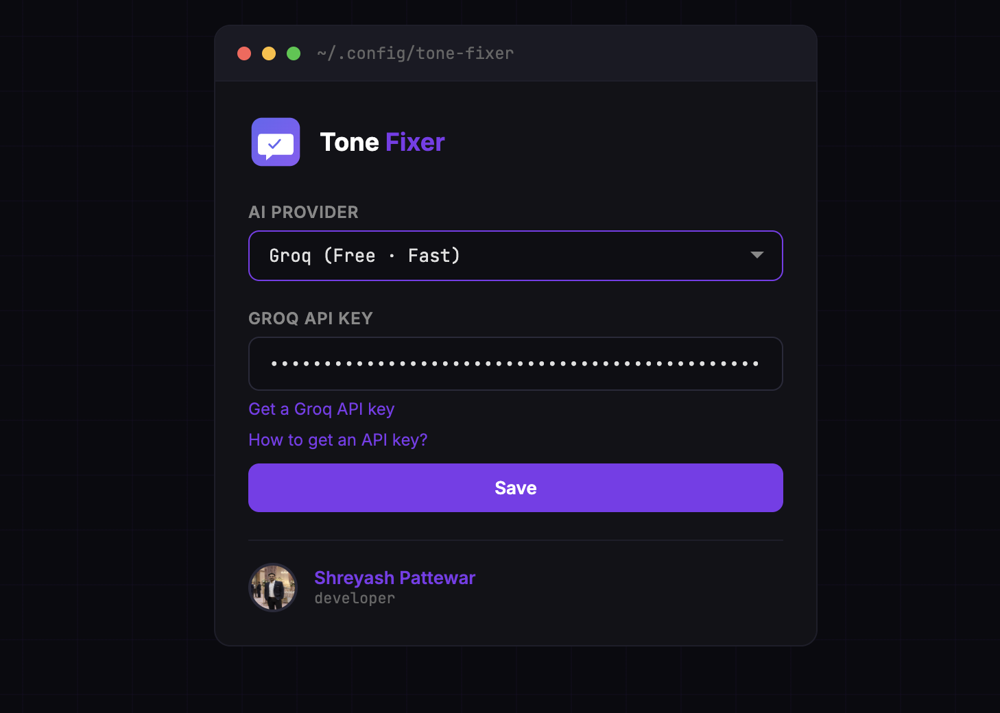

# Tone Fixer

**Rewrite any text in the perfect tone. A Chrome extension powered by Groq (free), OpenRouter (free), Claude, ChatGPT, Gemini, or Grok.**

## Features

- **Multiple AI providers** — Groq (free, no billing), OpenRouter (free, no billing), Claude, ChatGPT, Gemini, Grok
- **9 tone modes** — Polite, Casual, Formal, Professional, Friendly, Confident, Empathetic, Concise, Persuasive
- **Quick-pick tone pills** — One-click Polite / Casual / Formal with full dropdown for the rest
- **Smart formatting** — Send to Teams/Chat or Email with auto-adjusted output
- **Custom instructions** — Optional instruction field (e.g. "Sign as Shreyash")
- **Live character counter** — See your input length in real time
- **Output stats** — Word and character count on generated text
- **Editable output** — Edit the result before copying
- **One-click copy** — Clipboard icon with green checkmark feedback
- **Dark terminal theme** — Matches the developer's portfolio aesthetic
- **Privacy-first** — Your API key stays in local storage; no data sent anywhere except the AI provider you choose

## Screenshots

| Demo | Settings |
|------|----------|
|  |  |

## Installation

1. Download or clone this repo
2. Open Chrome and go to `chrome://extensions`
3. Enable **Developer mode** (top right)
4. Click **Load unpacked** and select the `tone-fixer` folder
5. Click the extension icon in the toolbar to open the popup

## Usage

1. Open the popup and paste your text
2. Select a tone (quick-pick pills or dropdown)
3. Choose the target destination (Teams/Chat or Email)
4. Add optional instructions
5. Click the play button to generate
6. Edit or copy the result with the clipboard icon

> **First time?** Open Settings and enter an API key for your preferred provider.
> **Groq** and **OpenRouter** offer a free tier (no credit card) — see the [API Key Guide](guide.html).

## Providers

| Provider | API Key Needed | Model | Free Tier | Speed |
|----------|---------------|-------|-----------|-------|
| Groq | Yes | llama-3.3-70b-versatile | Yes (no card) | Fast |
| OpenRouter | Yes | gpt-oss-20b:free | Yes (no card) | Moderate |
| Claude | Yes | claude-sonnet-4-5 | No | Fast |
| ChatGPT | Yes | gpt-4o | No | Fast |
| Gemini | Yes | gemini-2.0-flash | Billing required | Fast |
| Grok | Yes | grok-4.5 | No | Fast |

## Configuration

Open the extension settings to:
- Select your AI provider
- Enter your API key
- Toggle between providers

## Development

```
git clone https://github.com/shreyashp47/tone-fixer.git
```

No build step required — this is a plain JavaScript Chrome extension (MV3).

## License

MIT
